# Frontend Mentor - Tic Tac Toe solution

This is a solution to the [Tic Tac Toe challenge on Frontend Mentor](https://www.frontendmentor.io/challenges/tic-tac-toe-game-Re7ZF_E2v).
Frontend Mentor challenges help you improve your coding skills by building realistic projects.

## Overview

### The challenge

Users should be able to:

- View the optimal layout for the game depending on their device's screen size
- See hover states for all interactive elements on the page
- Play the game either solo vs the computer or multiplayer against another person
- **Bonus 1**: Save the game state in the browser so that it’s preserved if the player refreshes their browser
- **Bonus 2**: Instead of having the computer randomly make their moves, try making it clever so it’s proactive in blocking your moves and trying to win

### Features

- Player vs Player mode
- Player vs CPU mode (random CPU moves)
  - To see the clever CPU moves, uncomment the useEffect in Game.js and go minimax.js file
- Player mark selection (X / O)
- Turn indicator
- Win, loss, and tie detection
- Scoreboard persisted across rounds
- Next round flow without resetting scores
- Restart confirmation modal
- Quit back to main menu
- Clean UI with visual feedback for turns and results

### Screenshot

<table>
  <tr>
    <td>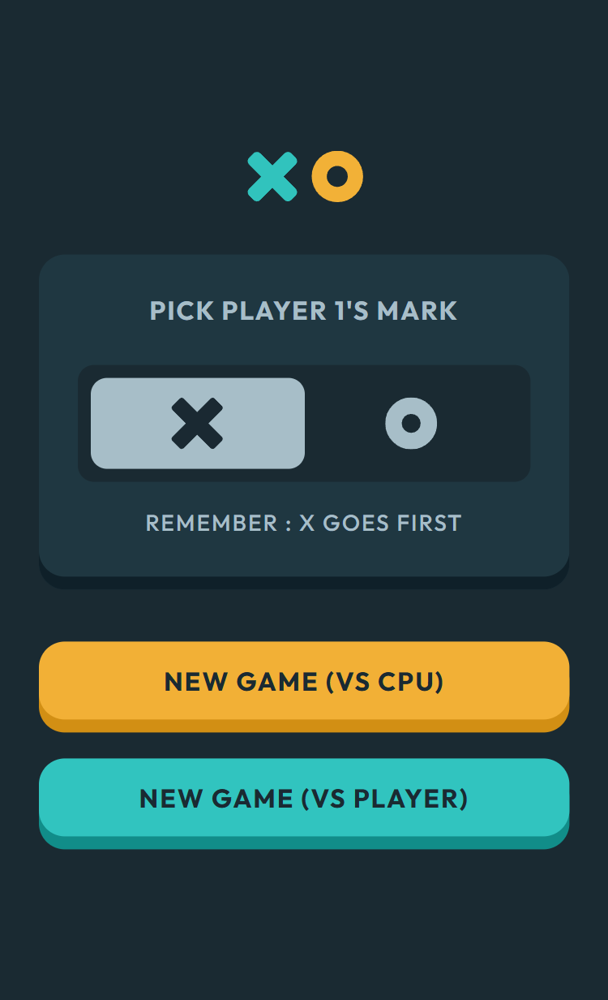</td>
    <td>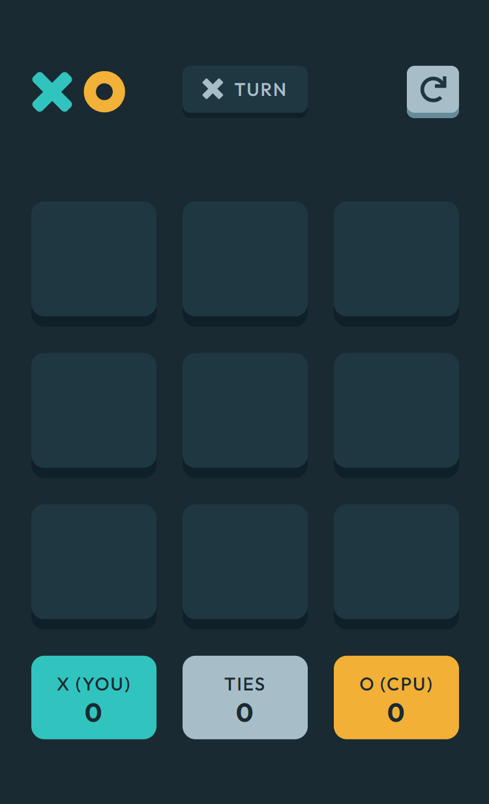</td>
    <td>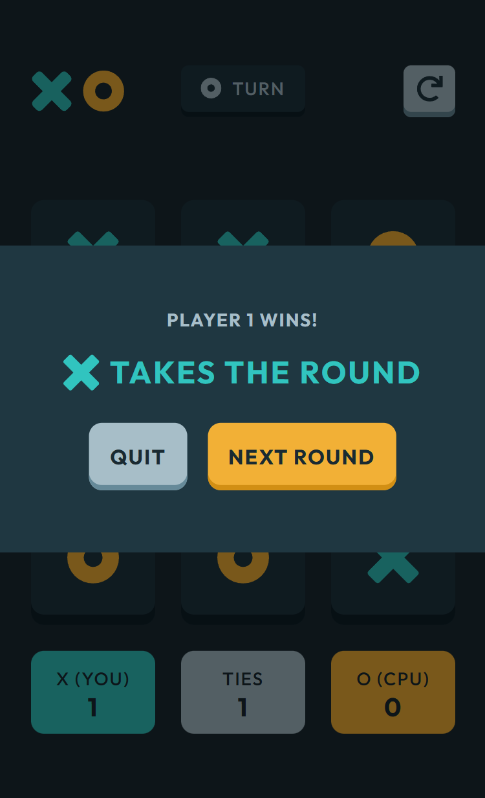</td>
    <td>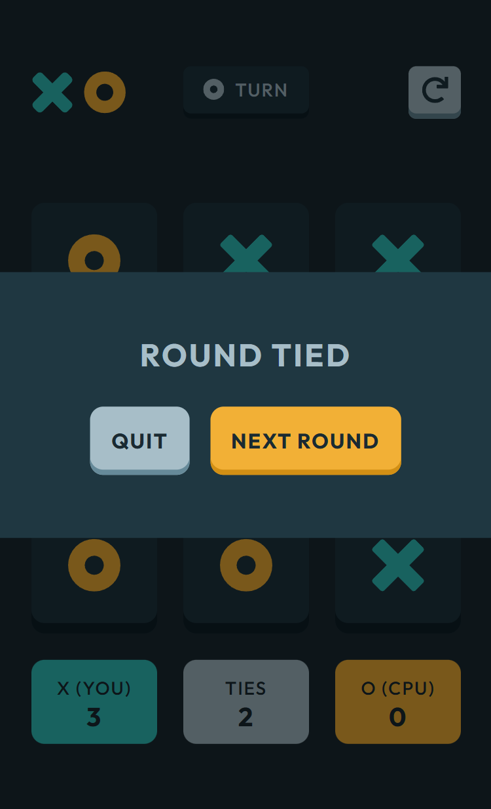</td>
    <td>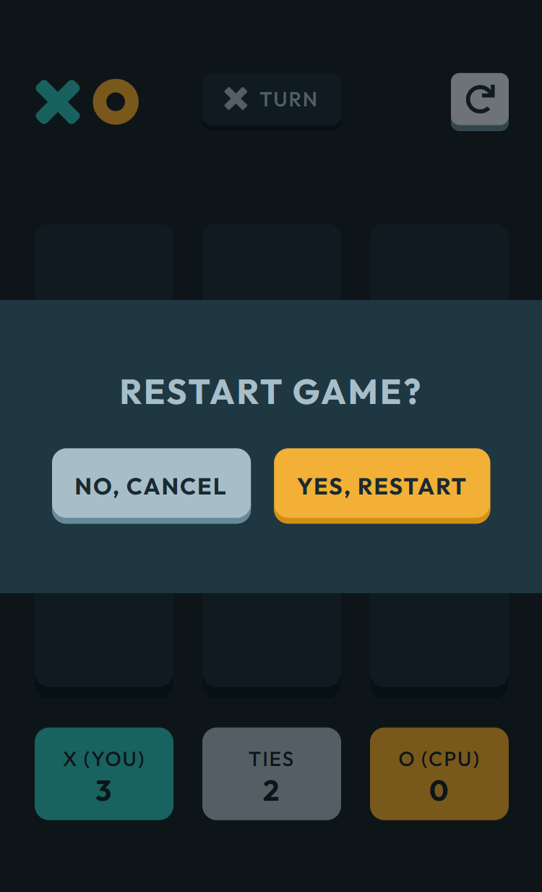</td>
    <td>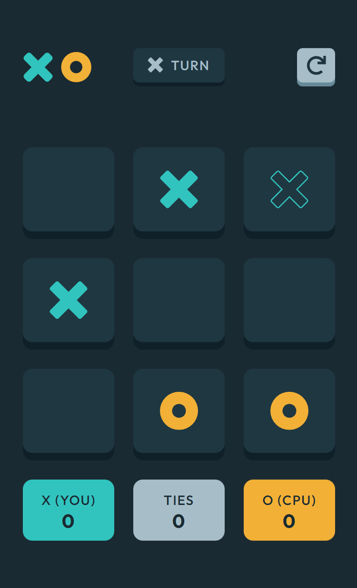</td>
  </tr>
  <tr>
    <td>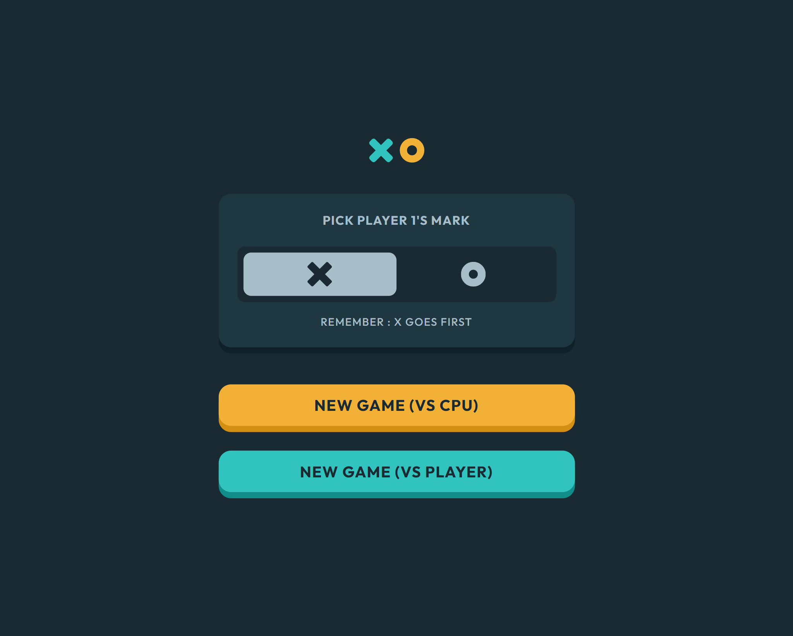</td>
    <td>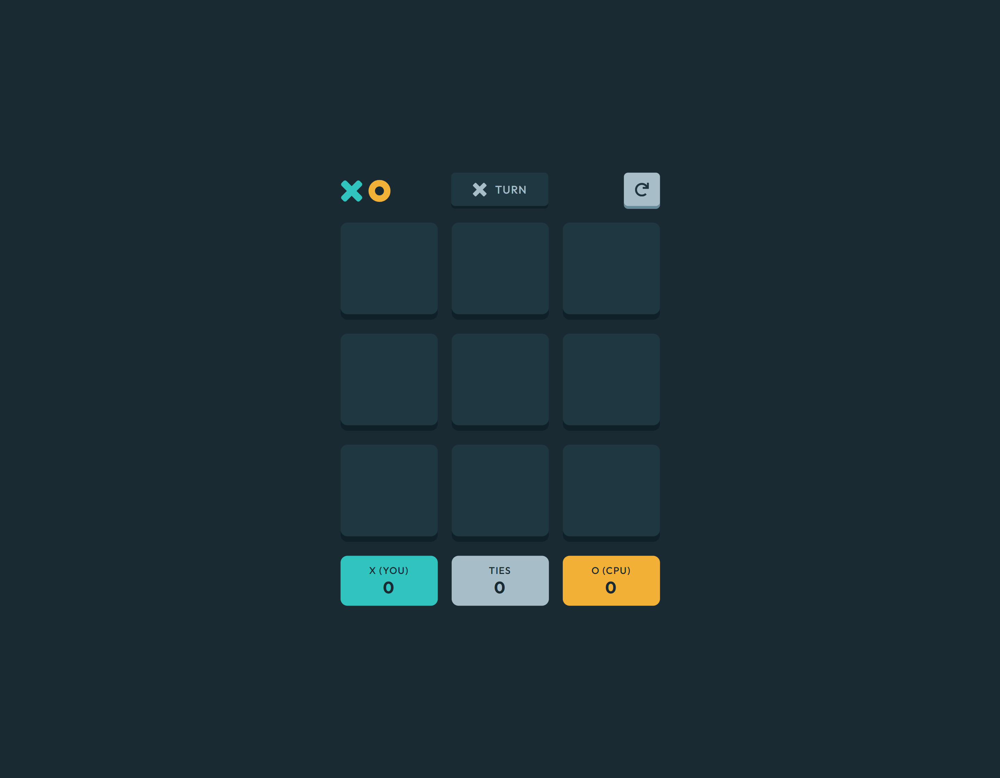</td>
    <td>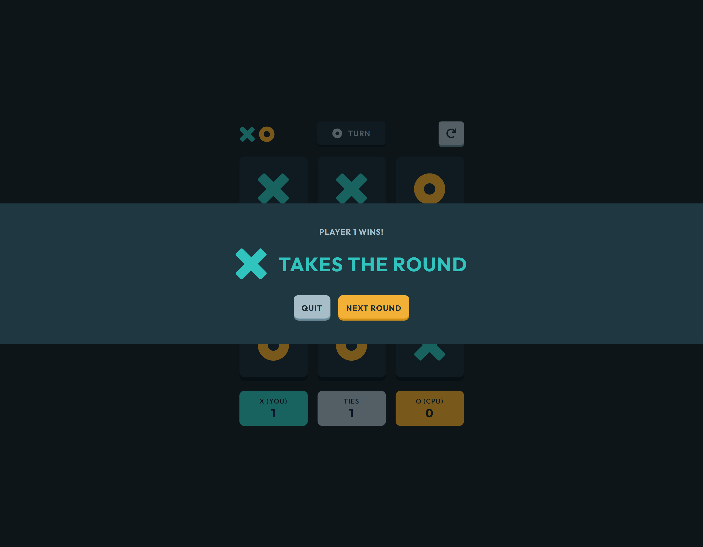</td>
    <td>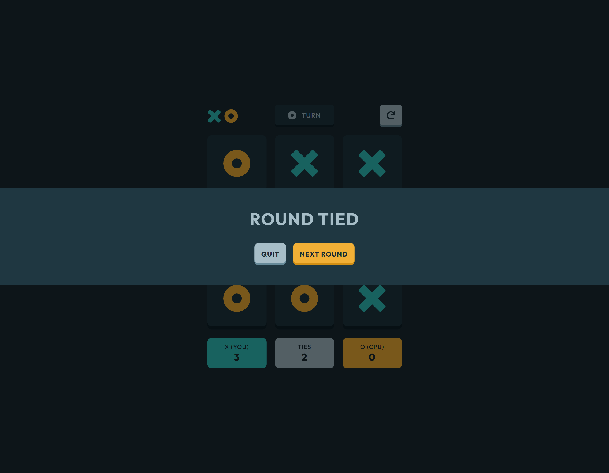</td>
    <td>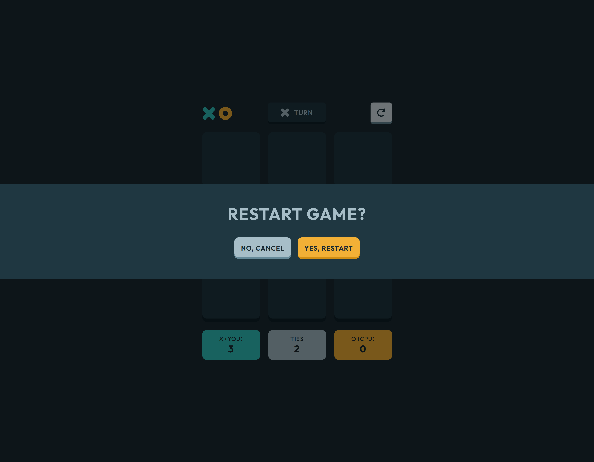</td>
    <td>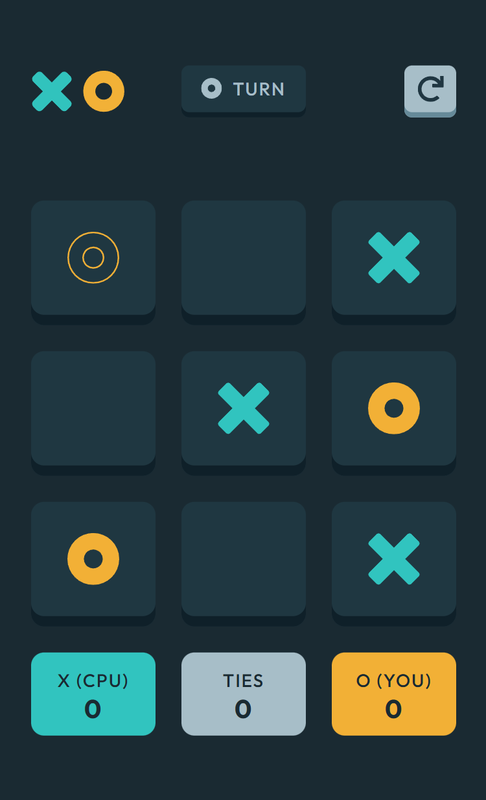</td>
  </tr>
</table>

### Links

- Solution URL: https://www.frontendmentor.io/solutions/tic-tac-toe-with-react-gJp44hjUAV
- Live Site URL: https://mzdemir-tic-tac-toe.netlify.app/
- Githup Repo: https://github.com/mzdemir/tic-tac-toe-with-react

## My process

### Built with

- [React](https://reactjs.org/) - JS library
- Semantic HTML5 markup
- CSS custom properties
- Flexbox
- CSS Grid
- Mobile-first workflow

### What I learned

- How to think in state-driven UI instead of DOM manipulation
- How to model game logic cleanly in React
- Why derived state is better than duplicated state
- How to refactor toward reuse instead of adding components
- When not to implement advanced logic

### Continued development

##### Some other improvements that I may add:

- Smarter CPU (rule-based or Minimax)
- Difficulty levels
- Keyboard Navigation for game board

## Author

- Github - https://github.com/mzdemir
- Frontend Mentor - https://www.frontendmentor.io/profile/mzdemir
